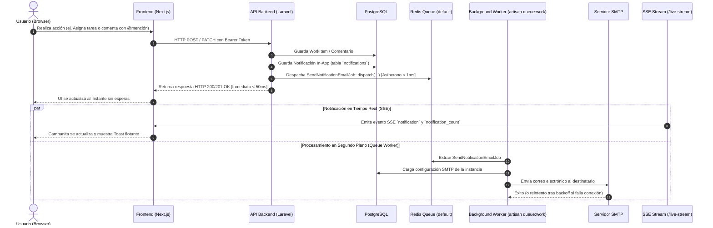
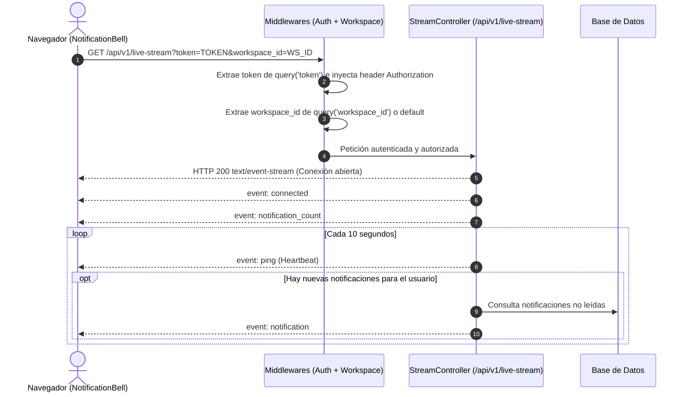

# Arquitectura y Guía de Implementación: Event Sourcing (Live Stream 401) y Sistema de Notificaciones Asíncronas (Colas / Jobs)

Este documento contiene la especificación técnica completa, análisis de causa raíz, arquitectura de software, código de referencia y plan de verificación para:
1. **Solucionar el error `401 Unauthorized` en el endpoint de Event Sourcing (`/api/v1/live-stream`)**.
2. **Implementar el sistema integral de notificaciones en App y por Correo Electrónico**.
3. **Garantizar que el 100% de los correos se ejecuten de forma asíncrona mediante Colas y Jobs de Laravel (`ShouldQueue`) para no impactar la interfaz visual ni bloquear peticiones HTTP**.

---

## 1. Diagnóstico y Causa Raíz del Error 401

### 1.1. Limitación del Estándar `EventSource` (W3C)
El objeto nativo `EventSource` en navegadores web (usado para Server-Sent Events / SSE):
- **No admite el envío de encabezados HTTP personalizados** (no se puede enviar `Authorization: Bearer <token>` ni `X-Workspace-Id`).
- Solo permite enviar cookies (con `withCredentials: true`), pero la API de Plane está basada en tokens Bearer de autenticación desacoplada.

### 1.2. Brecha en el Frontend (`apps/web/components/plane/notifications/NotificationBell.tsx`)
```tsx
// Código actual problemático:
eventSource = new EventSource(`${API_BASE_URL}/live-stream`);
```
No proporcionaba ningún mecanismo alternativo para autenticarse, por lo que la petición llegaba sin credenciales.

### 1.3. Brecha en los Middlewares Backend (`apps/api`)
1. **`AuthenticateSdiUser.php`**:
   ```php
   // Solo leía el header Authorization:
   $token = $request->bearerToken();
   ```
   Al no venir el header, `$token` era `null` y arrojaba inmediatamente `401 Unauthorized`.
2. **`IdentifyWorkspace.php`**:
   ```php
   // Solo leía encabezados o parámetros de ruta:
   $workspaceId = $request->header('X-Workspace-Id') ?? $request->route('workspace_id');
   ```
   No leía el parámetro `workspace_id` de la query string ni hacía fallback al workspace activo del usuario autenticado.

---

## 2. Principio Arquitectónico: Despacho Asíncrono Obligatorio (Colas / Jobs)

> [!IMPORTANT]
> **Cero Impacto Visual y Cero Latencia en la UI**:
> El envío de un correo electrónico por SMTP puede tardar entre 500 ms y 8 segundos (o fallar por problemas de red).
> **Ninguna llamada de envío SMTP debe ejecutarse en el ciclo de vida síncrono de la petición HTTP.**
> Todas las acciones (asignar tarea, mover tarjeta en Kanban, cambiar estado, comentar o completar ciclo) deben:
> 1. Persistir el cambio en base de datos (< 10 ms).
> 2. Crear el registro en la tabla `notifications` (< 5 ms).
> 3. Encolar el Job de correo en segundo plano (`SendNotificationEmailJob::dispatch(...)`) (< 1 ms).
> 4. Retornar inmediatamente respuesta `200/201` al frontend (< 50 ms).
> 5. El trabajador de colas (`php artisan queue:work`) procesa y envía el correo en segundo plano.

---

## 3. Diagramas de Arquitectura

### 3.1. Flujo de Notificaciones y Despacho Asíncrono



### 3.2. Conexión de Event Sourcing (SSE) Autenticada



---

## 4. Matriz Completa de Acciones a Notificar

| Módulo | Acción del Usuario | Notificación In-App | Notificación por Correo | Destinatarios | Mailable / Plantilla |
|---|---|---|---|---|---|
| **Work Items** | **Asignación** (Crear tarea o actualizar `lead_id` / `assignees`) | ✅ `ASSIGNMENT` | ✅ Encolada (`SendNotificationEmailJob`) | Asignado(s) excepto el autor | `WorkItemAssignedMail` (`work_item_assigned.blade.php`) |
| **Work Items** | **Cambio de Estado** (Kanban drag o selector) | ✅ `STATE_CHANGED` | ✅ Encolada (`SendNotificationEmailJob`) | Creador, líder y asignados | `WorkItemStatusChangedMail` (`work_item_status_changed.blade.php`) |
| **Work Items** | **Nuevo Comentario** | ✅ `COMMENT` | ✅ Encolada (`SendNotificationEmailJob`) | Creador y colaboradores | `WorkItemCommentMail` (`work_item_comment.blade.php`) |
| **Work Items** | **Mención (@usuario)** | ✅ `MENTION` | ✅ Encolada (`SendNotificationEmailJob`) | Usuarios mencionados | `UserMentionedMail` (`user_mentioned.blade.php`) |
| **Ciclos** | **Ciclo Completado** | ✅ `CYCLE_COMPLETED` | ✅ Encolada (`SendNotificationEmailJob`) | Miembros del proyecto | `CycleCompletedMail` (`cycle_completed.blade.php`) |
| **Proyectos** | **Miembro añadido directamente** | ✅ `PROJECT_MEMBER_ADDED` | ✅ Encolada (`SendNotificationEmailJob`) | Usuario añadido | `ProjectMemberAddedMail` (`project_member_added.blade.php`) |
| **Proyectos** | **Invitación por token enviada** | - | ✅ Encolada (`SendNotificationEmailJob`) | Correo invitado | `ProjectInvitationMail` (`project_invitation.blade.php`) |
| **Proyectos** | **Invitación aceptada / Onboarding** | ✅ `INVITATION_ACCEPTED` | ✅ Encolada (`SendNotificationEmailJob`) | Quien invitó | `ProjectInvitationAcceptedMail` |

---

## 5. Código de Implementación Paso a Paso

### Paso 1: Autenticación SSE por Query Parameter en Middlewares

#### Archivo: `apps/api/app/Http/Middleware/AuthenticateSdiUser.php`
Permitir token en query string y propagarlo al header Authorization:
```php
protected function resolveUser(Request $request): ?User
{
    // 1. Obtener token desde Bearer header, o query string ('token' o 'bearer_token')
    $token = $request->bearerToken() 
        ?: $request->query('token') 
        ?: $request->query('bearer_token');

    if ($token && !$request->headers->has('Authorization')) {
        $request->headers->set('Authorization', 'Bearer ' . $token);
    }

    if (!$token) {
        return null;
    }

    // Resolver usuario normalmente contra base de datos o servicio SDI...
    return $this->findUserByToken($token);
}
```

#### Archivo: `apps/api/app/Http/Middleware/IdentifyWorkspace.php`
Soportar workspace en query string y fallback al workspace del usuario:
```php
$workspaceId = $request->header('X-Workspace-Id')
    ?? $request->route('workspace_id')
    ?? $request->query('workspace_id')
    ?? $request->user()?->workspaces()->first()?->id;
```

---

### Paso 2: Creación del Job Asíncrono de Correo

#### Archivo: `apps/api/app/Jobs/SendNotificationEmailJob.php`
```php
<?php

namespace App\Jobs;

use App\Services\InstanceAdminService;
use Illuminate\Bus\Queueable;
use Illuminate\Contracts\Queue\ShouldQueue;
use Illuminate\Foundation\Bus\Dispatchable;
use Illuminate\Mail\Mailable;
use Illuminate\Queue\InteractsWithQueue;
use Illuminate\Queue\SerializesModels;
use Illuminate\Support\Facades\Log;
use Throwable;

class SendNotificationEmailJob implements ShouldQueue
{
    use Dispatchable, InteractsWithQueue, Queueable, SerializesModels;

    /**
     * Número de reintentos automáticos.
     */
    public int $tries = 3;

    /**
     * Segundos de espera entre reintentos.
     */
    public int $backoff = 15;

    public function __construct(
        public readonly string $recipientEmail,
        public readonly Mailable $mailable,
    ) {}

    /**
     * Ejecuta el trabajo en el proceso worker en segundo plano.
     */
    public function handle(InstanceAdminService $adminService): void
    {
        try {
            $mailer = $adminService->getInstanceMailer();
            $mailer->to($this->recipientEmail)->send($this->mailable);
        } catch (Throwable $e) {
            Log::warning("Fallo al enviar correo en cola a {$this->recipientEmail}: " . $e->getMessage());

            if (!app()->environment('testing')) {
                throw $e;
            }
        }
    }
}
```

---

### Paso 3: Integración en `NotificationService`

#### Archivo: `apps/api/app/Services/NotificationService.php`
Extender `sendNotification` para registrar en DB y despachar el Job encolado:
```php
public function sendNotification(
    int|string $workspaceId,
    int|string $recipientId,
    int|string|null $actorId,
    string $type,
    string $entityType,
    int|string $entityId,
    string $title,
    string $message,
    ?string $targetUrl = null,
    ?\Illuminate\Mail\Mailable $mailable = null
): Notification {
    // 1. Guardar notificación en base de datos para la campanita In-App
    $notification = Notification::create([
        'workspace_id' => $workspaceId,
        'recipient_id' => $recipientId,
        'actor_id'     => $actorId,
        'type'         => strtoupper($type),
        'entity_type'  => strtoupper($entityType),
        'entity_id'    => $entityId,
        'title'        => $title,
        'message'      => $message,
        'target_url'   => $targetUrl,
        'is_read'      => false,
    ]);

    // 2. Si hay un mailable asociado y destinatario válido, encolar el Job de correo
    if ($mailable) {
        $recipient = \App\Models\User::find($recipientId);
        if ($recipient && !empty($recipient->email)) {
            try {
                \App\Jobs\SendNotificationEmailJob::dispatch($recipient->email, $mailable);
            } catch (\Throwable $e) {
                \Illuminate\Support\Facades\Log::warning("No se pudo encolar correo de notificación: " . $e->getMessage());
            }
        }
    }

    return $notification;
}
```

---

### Paso 4: Migración de Envíos Existentes en `ProjectMemberService`

#### Archivo: `apps/api/app/Services/ProjectMemberService.php`
Reemplazar los envíos síncronos `send(...)` por encolamiento vía `SendNotificationEmailJob`:
```php
// En addMember (Línea ~101):
try {
    SendNotificationEmailJob::dispatch(
        $existingUser->email,
        new ProjectMemberAddedMail(
            project: $project->loadMissing('workspace'),
            member: $existingUser,
            inviter: $inviter,
            role: $role,
            projectUrl: $projectUrl
        )
    );
} catch (\Throwable $e) {
    Log::warning("Error al encolar correo de bienvenida: " . $e->getMessage());
}

// En inviteByEmail (Línea ~152):
try {
    SendNotificationEmailJob::dispatch(
        $email,
        new ProjectInvitationMail($invitation, $inviteUrl)
    );
} catch (\Throwable $e) {
    Log::warning("Error al encolar invitación: " . $e->getMessage());
}
```

---

### Paso 5: Mailables y Plantillas Blade Responsivas

Crear las siguientes clases en `apps/api/app/Mail/`:
1. **`WorkItemAssignedMail.php`** -> `resources/views/emails/work_item_assigned.blade.php`
2. **`WorkItemStatusChangedMail.php`** -> `resources/views/emails/work_item_status_changed.blade.php`
3. **`WorkItemCommentMail.php`** -> `resources/views/emails/work_item_comment.blade.php`
4. **`UserMentionedMail.php`** -> `resources/views/emails/user_mentioned.blade.php`
5. **`CycleCompletedMail.php`** -> `resources/views/emails/cycle_completed.blade.php`

**Plantilla base responsiva con diseño limpio y botón CTA**:
```html
<!DOCTYPE html>
<html>
<head>
    <meta charset="utf-8">
    <style>
        body { font-family: -apple-system, BlinkMacSystemFont, 'Segoe UI', Roboto, Helvetica, Arial, sans-serif; background-color: #f8fafc; color: #1e293b; margin: 0; padding: 24px; }
        .card { max-width: 580px; margin: 0 auto; background: #ffffff; border-radius: 12px; border: 1px solid #e2e8f0; padding: 32px; box-shadow: 0 4px 6px -1px rgba(0,0,0,0.05); }
        .badge { display: inline-block; padding: 4px 10px; border-radius: 9999px; font-size: 12px; font-weight: 600; background: #f1f5f9; color: #475569; }
        .btn { display: inline-block; background-color: #2563eb; color: #ffffff !important; padding: 10px 20px; border-radius: 8px; text-decoration: none; font-weight: 500; margin-top: 20px; }
        .footer { text-align: center; margin-top: 24px; font-size: 12px; color: #94a3b8; }
    </style>
</head>
<body>
    <div class="card">
        <h2>{{ $title }}</h2>
        <p>{{ $body }}</p>
        <a href="{{ $actionUrl }}" class="btn">Ver en Plane</a>
    </div>
    <div class="footer">Plane &bull; Notificación del Sistema</div>
</body>
</html>
```

---

### Paso 6: Actualización del Cliente Frontend (`NotificationBell.tsx`)

#### Archivo: `apps/web/components/plane/notifications/NotificationBell.tsx`
Construir la URL del `EventSource` con token y workspace:
```tsx
useEffect(() => {
  const token = storage.get(ACCESS_TOKEN);
  const currentWs = storage.get(CURRENT_WORKSPACE);
  if (!token || typeof window === "undefined") return;

  const streamUrl = new URL(`${API_BASE_URL}/live-stream`);
  streamUrl.searchParams.set("token", token);
  if (currentWs?.id) {
    streamUrl.searchParams.set("workspace_id", String(currentWs.id));
  }

  const es = new EventSource(streamUrl.toString());

  es.addEventListener("connected", () => {
    console.log("[LiveStream] Conectado exitosamente.");
  });

  es.addEventListener("notification_count", (e) => {
    const data = JSON.parse(e.data);
    setUnreadCount(data.count ?? 0);
  });

  es.addEventListener("notification", (e) => {
    const notif = JSON.parse(e.data);
    setNotifications((prev) => [notif, ...prev]);
    setUnreadCount((c) => c + 1);
    toast.info(notif.title, {
      description: notif.message,
    });
  });

  return () => {
    es.close();
  };
}, []);
```

---

## 6. Plan de Verificación y Testing

### 6.1. Pruebas Automatizadas en Backend
Ejecutar con `php artisan test`:
1. **Verificación de Colas**:
   - `Queue::fake()`: Comprobar que `SendNotificationEmailJob::class` es encolado al asignar una tarea, comentar con mención o completar ciclo.
2. **Verificación de Autenticación SSE**:
   - Petición a `/api/v1/live-stream?token=...` sin header Authorization retorna `200 OK` y cabecera `Content-Type: text/event-stream`.
   - Petición sin token retorna `401 Unauthorized`.
3. **Verificación de Envío de Correo (Mail Fake)**:
   - Con `QUEUE_CONNECTION=sync` (modo tests), verificar que `Mail::assertSent(WorkItemAssignedMail::class)` captura el correo.
4. **Regresión Completa**:
   - Validar que los 97 tests existentes continúen pasando con éxito.

### 6.2. Verificación de Compilación Frontend
Ejecutar en `apps/web`:
```bash
npm run build
```
Comprobar 0 errores de compilación TypeScript y bundling en Turbopack.

### 6.3. Verificación de Procesos en Docker
El contenedor `project_managment` ya tiene configurado el worker de colas en supervisord (`artisan queue:work --queue=default`).
Para recargar las clases al desplegar:
```bash
docker exec project_managment php artisan queue:restart
```
