# Plan Integral: Fases del Módulo de Reportes Dinámicos de Workspace

Este documento establece la arquitectura, estado actual y hoja de ruta exhaustiva del **Módulo de Reportes Dinámicos a nivel de Workspace** en la plataforma, permitiendo a Directores, Product Managers y Stakeholders componer dashboards ejecutivos editoriales (datos + narrativa) con visualización en tiempo real, exportación fiel a PDF y programación automática.

---

## Estado General del Proyecto

```mermaid
flowchart LR
    Fase1["Fase 1: Fundaciones & CRUD\n(COMPLETADA)"] --> Fase2["Fase 2: Bloques Core & Temas\n(COMPLETADA)"]
    Fase2 --> Fase3["Fase 3: 19 Bloques Completos\n(COMPLETADA)"]
    Fase3 --> Fase4["Fase 4: Plantillas & Snapshots\n(COMPLETADA)"]
    Fase4 --> Fase5["Fase 5: Exportación PDF/PNG Server-Side\n(COMPLETADA)"]
    Fase5 --> Fase6["Fase 6: Scheduler & Envíos Automáticos\n(SIGUIENTE)"]

    style Fase1 fill:#10b981,stroke:#059669,color:#fff
    style Fase2 fill:#10b981,stroke:#059669,color:#fff
    style Fase3 fill:#10b981,stroke:#059669,color:#fff
    style Fase4 fill:#10b981,stroke:#059669,color:#fff
    style Fase5 fill:#10b981,stroke:#059669,color:#fff
    style Fase6 fill:#3b82f6,stroke:#2563eb,color:#fff
```



---

## 1. Fase 1: Fundaciones, CRUD y Primeros Bloques [COMPLETADA ✅]

Objetivo: Establecer la arquitectura desacoplada backend/frontend, modelo de datos relacional y JSONB, sistema de arrastrar y soltar (dnd-kit) en 3 columnas y los primeros bloques operativos.

### Backend (Laravel 13 - PHP 8.4)
- **Migraciones de Base de Datos:**
  - `workspace_reports`: Reportes con título, descripción, visibilidad (`draft`, `private`, `workspace`, `public`), configuración de tema y layout en `jsonb`, token público y fecha de publicación.
  - `report_blocks`: Bloques con tipo, título, posición, ancho (1-12 columnas), configuración en `jsonb`, caché de datos y visibilidad.
  - `report_schedules`: Programaciones recurrentes (diaria, semanal, mensual, cron) con lista de destinatarios.
  - `report_snapshots`: Versionado y congelamiento de bloques y data histórica.
  - `report_delivery_logs`: Auditoría de envíos y estados.
- **Enums Tipados:** `BlockType` (19 tipos), `ReportVisibility`, `ScheduleFrequency`.
- **Patrón Action:** `CreateReportAction`, `UpdateReportAction`, `DeleteReportAction`, `DuplicateReportAction`, `CreateReportBlockAction`, `UpdateReportBlockAction`, `DeleteReportBlockAction`, `ReorderBlocksAction`.
- **Motor de Datos (Strategy Pattern):** `BlockResolverService` con soporte de caché Redis de 5 minutos y método `resolveAll()`.
- **Resolvers Iniciales:**
  - `kpi_row`: Conteo de total, completadas, en progreso y vencidas con deltas porcentuales y sparklines de 7 días.
  - `narrative`: Soporte para contenido editorial Tiptap.
  - `line_chart`: Evolución de ítems creados/completados con agrupación por día, semana o mes.
- **Controladores y Rutas API v1:** `WorkspaceReportController`, `ReportBlockController`, `ReportDataController`.
- **Seeder:** `WorkspaceReportSeeder` con reporte de ejemplo "Reporte Ejecutivo Semanal".

### Frontend (Next.js 16 - App Router & TypeScript)
- **Servicio y Tipos:** `workspace-report-service.ts` y `workspace-report-types.ts`.
- **Página Principal:** `/workspace-reports` con grid de tarjetas, estado vacío, filtros por visibilidad y acciones (editar, duplicar, eliminar, compartir).
- **Editor Visual en 3 Columnas:** `/workspace-reports/[reportId]/edit`:
  - Sidebar izquierdo: Catálogo de bloques por categorías con búsqueda y tabs (Bloques, Plantillas, Temas).
  - Canvas central: Reordenamiento drag-and-drop con `@dnd-kit`, controles de zoom, visualización en grid de 12 columnas.
  - Panel lateral derecho: Configuración contextual en tiempo real según el bloque activo seleccionado.

---

## 2. Fase 2: Expansión de Bloques Core, Temas Visuales y Vista Pública [COMPLETADA ✅]

Objetivo: Incrementar la capacidad analítica con 6 nuevos tipos de bloques visuales, posibilitar el cambio global de estilo temático y publicar reportes accesibles externamente sin autenticación.

### Bloques Implementados (9 bloques acumulados)
1. **`bar_chart`:** Comparativa visual agrupada por Estado o Prioridad, métrica por conteo o story points (`BarChartBlock.tsx` y `BarChartResolver.php`).
2. **`donut_chart`:** Distribución porcentual por categorías con selector de leyendas y segmentos coloreados (`DonutChartBlock.tsx` y `DonutChartResolver.php`).
3. **`area_chart`:** Evolución temporal con degradados de ítems creados vs completados (`AreaChartBlock.tsx` y `AreaChartResolver.php`).
4. **`project_summary`:** Indicadores de salud (*On Track*, *At Risk*, *Delayed*), barra de progreso %, miembros con avatares y fechas clave (`ProjectSummaryBlock.tsx` y `ProjectSummaryResolver.php`).
5. **`table`:** Tabla configurable de ítems con selección de columnas, ordenación y límites (`TableBlock.tsx` y `TableResolver.php`).
6. **`work_items_list`:** Lista compacta con filtros rápidos (*urgentes*, *vencidas* usando `target_date`, *sin asignar*, *recientes*) (`WorkItemsListBlock.tsx` y `WorkItemsListResolver.php`).

### Temas Globales Dinámicos
- 5 temas predefinidos con tokens tipográficos, radios y paletas de color en `REPORT_THEMES`:
  - `default_light` (Limpio moderno)
  - `default_dark` (Zinc modo oscuro)
  - `corporate_blue` (Azul ejecutivo)
  - `minimal_mono` (Monospace editorial de alto contraste)
  - `warm_neutral` (Serif y acentos cálidos)
- Los temas se aplican en cascada en el canvas del editor, en la vista interna de reporte y en la página pública.

### Vista Pública y Compartición
- **Ruta Pública:** `/r/[publicToken]`, completamente desacoplada del layout autenticado.
- Modo presentación a pantalla completa vía Fullscreen API.
- Generación y revocación de tokens públicos de 32 caracteres criptográficos.
- Resolución automática en el backend de la data de bloques en el endpoint público `GET /api/v1/public/workspace-reports/{token}`.
- **Verificación:** 16 tests pasando en Pest PHP (52 aserciones) y compilación limpia de Next.js (`pnpm build`).

---

## 3. Fase 3: Bloques de Proceso, Colaboración y Contexto [COMPLETADA ✅]

Objetivo: Completar el catálogo exhaustivo de 19 bloques, incorporando métricas de sprints/ciclos, hojas de ruta de releases, carga de trabajo del equipo, mapa de calor y bloques auxiliares de diseño.

### Catálogo Completo de 19 Bloques (100% Operativos)

```
Catálogo Total (19 Bloques):
├── Métricas & Gráficos: kpi_row, line_chart, bar_chart, donut_chart, area_chart, heatmap (6 bloques)
├── Proyectos & Hitos: project_summary, releases_timeline, milestones_progress (3 bloques)
├── Trabajo & Procesos: table, work_items_list, cycles_overview, team_workload, risks_blockers (5 bloques)
└── Contexto & Diseño: narrative, recent_activity, callout, divider, image (5 bloques)
```

#### Los 10 Bloques Agregados en Fase 3:
1. **`cycles_overview`:** Resumen de sprints activos y completados con barra de progreso, badges de estado (*Current*, *Upcoming*, *Completed*) y fechas (`CyclesOverviewBlock.tsx` y `CyclesOverviewResolver.php`).
2. **`releases_timeline`:** Línea de tiempo visual tipo roadmap con versiones publicadas y planificadas, fechas y conteo de tareas entregadas (`ReleasesTimelineBlock.tsx` y `ReleasesTimelineResolver.php`).
3. **`milestones_progress`:** Lista de hitos estratégicos con cálculo porcentual de avance, alertas de retraso si pasó la fecha meta y tareas completadas (`MilestonesProgressBlock.tsx` y `MilestonesProgressResolver.php`).
4. **`team_workload`:** Carga de trabajo por miembro del equipo con avatares, tareas activas vs completadas e indicador inteligente de saturación (*Disponible*, *Equilibrada*, *Carga Alta*, *Sobrecarga*) (`TeamWorkloadBlock.tsx` y `TeamWorkloadResolver.php`).
5. **`recent_activity`:** Feed de auditoría en tiempo real con avatares, descripción de acciones, entidades y marcas de tiempo relativo (`RecentActivityBlock.tsx` y `RecentActivityResolver.php`).
6. **`risks_blockers`:** Matriz de riesgos con contadores automáticos de tareas vencidas (`target_date`), estancadas (sin movimiento en N días) y urgentes pendientes (`RisksBlockersBlock.tsx` y `RisksBlockersResolver.php`).
7. **`heatmap`:** Mapa de calor de actividad estilo GitHub con densidad de trabajo por días de la semana y tooltip interactivo (`HeatmapBlock.tsx` y `HeatmapResolver.php`).
8. **`callout`:** Card editorial destacada con variantes (*Informativa*, *Advertencia*, *Éxito*, *Crítica*), iconos y soporte markdown (`CalloutBlock.tsx` y `CalloutResolver.php`).
9. **`divider`:** Separador visual configurable con estilos continuo, discontinuo, degradado o espacio en blanco (`DividerBlock.tsx` y `DividerResolver.php`).
10. **`image`:** Imagen corporativa, diagramas de arquitectura o branding por URL con pie de foto (*caption*) y alineación (`ImageBlock.tsx` e `ImageResolver.php`).

### Verificación Técnica de la Fase 3:
- **19 Resolvers Registrados:** Todos integrados en `BlockResolverService.php` con bypass de caché para bloques estáticos y caché Redis (TTL 5 min) para bloques analíticos.
- **Next.js Registry:** Todos los bloques conectados en `block-registry.tsx` con sus respectivos paneles de configuración lateral (`configPanelComponent`).
- **Pest PHP Tests:** **24/24 tests pasados (94 aserciones)** en `WorkspaceReportTest.php`.
- **Next.js Production Build:** Compilación limpia con **0 errores de TypeScript y App Router**.

---

## 4. Fase 4: Plantillas Predefinidas y Snapshots / Versionado [COMPLETADA ✅]

Objetivo: Permitir al usuario crear reportes en segundos a partir de plantillas ejecutivas estructuradas y congelar versiones periódicas (snapshots) con datos resueltos para auditoría, trazabilidad y restauración histórica.

### 1. Plantillas Predefinidas de Alto Impacto
- **`ReportTemplateService` en Backend:** Servicio centralizado que registra y aplica 5 plantillas ejecutivas completas con transaccionalidad DB:
  - **`weekly_exec` (Weekly Executive Report):** Project Summary + KPI Row + Risks & Blockers + Narrative + Recent Activity. Tema: `corporate_blue`.
  - **`sprint_review` (Sprint Review & Retrospectiva):** Cycles Overview + Completed Work Table + Burn-down Area Chart + Team Workload. Tema: `default_light`.
  - **`project_health` (Diagnóstico de Salud y Riesgos):** Project Summary + Donut Status + Risks & Blockers + Milestone Progress. Tema: `default_dark`.
  - **`product_roadmap` (Roadmap Trimestral & Releases):** Releases Timeline + Milestones Progress + KPI Row + Line Chart de entregas. Tema: `corporate_blue`.
  - **`team_capacity` (Capacidad y Carga de Equipo):** Team Workload + Bar Chart por miembro + Heatmap de actividad + Urgent Tasks List. Tema: `warm_neutral`.
- **Integración en Creación y Edición:**
  - En `/workspace-reports/new`: Selector visual de 6 opciones (Lienzo en blanco + 5 plantillas). Al enviar, el backend aplica la plantilla automáticamente en la creación (`store`).
  - En el Editor (`/workspace-reports/[id]/edit`): Tab dedicado "Plantillas" en `BlocksSidebar` que permite aplicar cualquier plantilla a un reporte existente con confirmación y refresco inmediato.
  - Endpoints dedicados: `GET /workspace-reports/templates` y `POST /workspace-reports/{report}/templates/{templateId}/apply`.

### 2. Sistema de Snapshots y Versionado Histórico Inmutable
- **Congelamiento de Datos y Bloques:**
  - `CreateReportSnapshotAction`: Ejecuta `BlockResolverService::resolveAll()` para congelar tanto la estructura de bloques como los datos exactos calculados, la configuración del tema, título y notas del autor en `report_snapshots`.
  - `RestoreReportSnapshotAction`: Permite restaurar el reporte a cualquier snapshot previo de forma instantánea.
- **API RESTful de Snapshots:**
  - `GET /workspace-reports/{report}/snapshots`: Listado cronológico de versiones.
  - `POST /workspace-reports/{report}/snapshots`: Creación manual o al publicar.
  - `GET /workspace-reports/{report}/snapshots/{snapshot}`: Ver versión congelada.
  - `DELETE /workspace-reports/{report}/snapshots/{snapshot}`: Eliminar versión.
  - `POST /workspace-reports/{report}/snapshots/{snapshot}/restore`: Restauración en 1 clic.
- **Frontend Interactivo:**
  - Botón "Versiones" en `EditorTopBar`.
  - Modal `ReportSnapshotsModal.tsx` con creación en línea de versiones (título + notas), listado con avatares de autor y fecha, restauración con advertencia de confirmación y eliminación.
- **Verificación:** **32/32 tests pasados (117 aserciones)** en Pest PHP y compilación limpia en Next.js 16 (`pnpm build`).

---

## 5. Fase 5: Exportación Servidor a PDF y PNG con Fidelidad Idéntica [COMPLETADA ✅]

Objetivo: Generar descargables en PDF y PNG de alta resolución donde la tipografía, colores, dimensiones y gráficas sean **100% idénticos a la pantalla web**.

> **Fidelidad Visual Absoluta:** Implementada exitosamente mediante `spatie/browsershot` ejecutando Chromium headless (`/usr/bin/chromium`) sobre un documento HTML estructurado y diseñado específicamente para impresión ejecutiva, garantizando la preservación de colores de fondo, gráficos vectoriales SVG y tipografía Inter.

### 1. Motor de Renderizado Backend (Laravel 13 - PHP 8.4)
- **`ReportHtmlRenderer`:** Servicio especializado que genera el documento HTML autosuficiente en base al tema activo (`primaryColor`, `surfaceColor`, `borderRadius`, etc.), cabecera ejecutiva, grilla de 12 columnas y renderizado visual/vectorial de los 19 tipos de bloques con `break-inside: avoid`.
- **`ExportReportPdfAction`:** Configuración de Browsershot con `setChromePath('/usr/bin/chromium')`, flags de sandbox (`no-sandbox`, `disable-dev-shm-usage`, `disable-gpu`), `showBackground()`, `emulateMedia('screen')`, formato A4 y márgenes milimétricos exactos.
- **`ExportReportPngAction`:** Configuración de captura completa (`fullPage()`) con densidad `deviceScaleFactor(2)` (Retina) para presentaciones y correos.
- **Endpoints RESTful:**
  - `GET /api/v1/workspaces/{workspace}/workspace-reports/{report}/export/pdf`: Descarga de PDF autenticada.
  - `GET /api/v1/workspaces/{workspace}/workspace-reports/{report}/export/png`: Descarga de PNG autenticada.
  - `GET /api/v1/public/workspace-reports/{token}/export/pdf`: Descarga de PDF pública sin autenticación.
  - `GET /api/v1/public/workspace-reports/{token}/export/png`: Descarga de PNG pública sin autenticación.

### 2. Frontend y Vista de Impresión Especializada (Next.js 16)
- **Ruta Dedicada de Renderizado:** `/render/report/[publicToken]`, limpia de elementos de navegación, con reglas `@media print` optimizadas para saltos de página y botón de impresión nativo del navegador (`window.print()`).
- **Botones de Descarga en Interfaces:**
  - En la vista interna del reporte (`/workspace-reports/[id]`): Botones dedicados "Imprimir", "PDF" y "PNG".
  - En la vista pública compartida (`/r/[publicToken]`): Barra superior con botones "Imprimir", "PDF" y "PNG".
  - En el Editor (`/workspace-reports/[id]/edit`): Botón directo "PDF" en la barra de herramientas superior.
  - Métodos utilitarios en `workspace-report-service.ts`: `downloadPdf()`, `downloadPng()`, `downloadPublicPdf()`, `downloadPublicPng()`.
- **Verificación:** **36/36 tests pasados (133 aserciones)** en Pest PHP y compilación limpia en Next.js 16 (`pnpm build`).

---

## 6. Fase 6: Programación de Envíos Automáticos (Scheduler & Delivery Logs) [SIGUIENTE PASO 🚀]

Objetivo: Automatizar la distribución periódica de reportes a directores y clientes mediante correo electrónico y webhooks (Slack/Teams) sin intervención humana recurrente.

### Arquitectura del Scheduler
- **Configuración de Frecuencias (`report_schedules`):**
  - Diaria, Semanal (día configurable), Mensual o Expresión Cron avanzada.
  - Lista de correos destinatarios configurables en el panel lateral del reporte.
- **Comando Artisan:**
  - `reports:run-scheduled`: Ejecutado cada minuto vía Laravel Scheduler en background.
  - Identifica programaciones activas donde `next_run_at <= now()`.
  - Despacha `SendScheduledReportJob` a la cola Redis y recalcula `next_run_at`.
- **Job de Envío (`SendScheduledReportJob`):**
  - Genera el PDF mediante el servicio de la Fase 5.
  - Envía correo electrónico corporativo con el PDF adjunto utilizando `SendNotificationEmailJob` (con soporte para servidores SMTP configurados en la plataforma).
  - (Opcional) Envía webhook a canales de Slack / Teams con el enlace público y resumen de KPIs.
  - Registra el resultado en `report_delivery_logs` con estado (`sent` o `failed`), mensaje de error si aplica y timestamp.
  - Reintentos automáticos: 3 intentos con retroceso exponencial de 60 segundos.

---

## Matriz Resumen de Fases y Tareas

| Fase | Título | Estado | Entregables Clave |
| :--- | :--- | :---: | :--- |
| **Fase 1** | Fundaciones & CRUD | **COMPLETADA** | 5 migraciones, 3 enums, 8 actions, 3 modelos, BlockResolverService, Editor dnd-kit 3 columnas, 3 bloques (`kpi_row`, `narrative`, `line_chart`), seeder y tests. |
| **Fase 2** | Bloques Core, Temas & Vista Pública | **COMPLETADA** | 6 nuevos resolvers, 6 componentes visuales (`bar_chart`, `donut_chart`, `area_chart`, `project_summary`, `table`, `work_items_list`), 5 temas dinámicos, ruta pública `/r/[publicToken]`, 16 tests passing, build limpio. |
| **Fase 3** | Proceso, Colaboración & Contexto | **COMPLETADA** | 10 resolvers y componentes (`cycles_overview`, `releases_timeline`, `milestones_progress`, `team_workload`, `recent_activity`, `risks_blockers`, `heatmap`, `callout`, `divider`, `image`). **19 bloques 100% operativos**, 24 tests passing. |
| **Fase 4** | Plantillas & Snapshots (Versionado) | **COMPLETADA** | Servicio de 5 plantillas ejecutivas, aplicación en creación y en editor, endpoints de snapshots, modal de versiones con restauración instantánea. **32 tests passing**. |
| **Fase 5** | Exportación PDF & PNG Server-Side | **COMPLETADA** | `spatie/browsershot` con Chromium headless, `ReportHtmlRenderer`, endpoints de descarga PDF/PNG autenticados y públicos, ruta `/render/report/[token]`, botones en vistas y editor. **36 tests passing**. |
| **Fase 6** | Scheduler & Envíos Automáticos | **PRÓXIMA** | Comando `reports:run-scheduled`, cola Redis con `SendScheduledReportJob`, envío de PDFs por email y Slack, logs de auditoría en `report_delivery_logs`. |

---

## Próximo Paso Recomendado

Iniciar la **Fase 6**: Implementar la **Programación de Envíos Automáticos (Scheduler)** con comando de cron, cola Redis (`SendScheduledReportJob`), envío de correos con PDF adjunto y panel de configuración de periodicidad y destinatarios.
